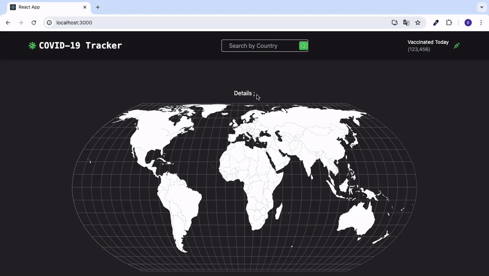

<h1>COVID 19 TRACKER</h1>

With our COVID-19 Tracker application, you can easily track COVID-19 data worldwide using a map view and country-based search. We utilize React, Redux Toolkit, Redux Thunk, and Axios to fetch data from Rapid API. The application is designed with a modern and sleek look using Tailwind CSS. Additionally, we enhance the user experience with supporting libraries like React Simple Maps, React Tooltip, and React Icons. We ensure data accuracy and application reliability with React Testing Library.

<h2> Software Languages </h2>

- HTML

- CSS

- JavaScript

<h2> Libraries </h2>

- React

- React Router 

- Redux

- Redux Toolkit

- Redux Thunk

- React Testing Library

- Axios

<h2> Framework </h2>

- Tailwind CSS

<h3> Minor Libraries </h3>

- React Simple Maps

- React Tooltip

- React Icons

<h2> Screen Gif </h2>

